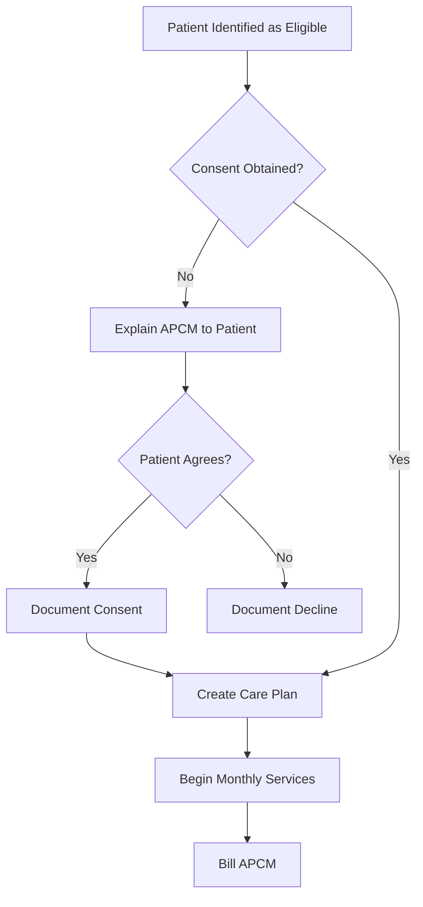

# APCM Team Workflow Checklist

**Home Team Medical Services**  
*Primary Care that Comes to You*

**Document Purpose**: Daily/Monthly workflow reference for APCM care team members  
**Last Updated**: November 30, 2025

---

## Quick Reference: APCM Billing Levels

| Code | Conditions | Monthly Payment | Patient Copay |
|------|------------|-----------------|---------------|
| **G0556** | 1 chronic condition | ~$67 | Yes (20%) |
| **G0557** | 2+ chronic conditions | ~$128 | Yes (20%) |
| **G0558** | 2+ conditions + QMB status | ~$128 | **None** |

---

## Monthly APCM Workflow Calendar

### Week 1 (Days 1-7): Setup & Patient Identification

#### Administrative Tasks
- [ ] Generate APCM patient list from Patient_Explorer (`3_APCM_Patients.py`)
- [ ] Export list with columns: MRN, Name, APCM Level, ICD Codes, Last Contact Date
- [ ] Verify Medicare Part B eligibility for each patient
- [ ] Confirm no hospice elections or other disqualifying status
- [ ] Check for new patients to enroll (qualifying conditions, established within 12 months)

#### Documentation Check
- [ ] Review consent status in Patient_Explorer for each patient
- [ ] Flag patients needing consent (new enrollees, consent expired/missing)
- [ ] Identify patients with upcoming scheduled appointments this month

### Week 2-3 (Days 8-21): Clinical Outreach & Care Coordination

#### Nursing Team (RN) Activities

**For Each APCM Patient:**

##### Care Plan Review
- [ ] Open patient chart in athenahealth
- [ ] Review current care plan for accuracy and completeness
- [ ] Update problem list if new conditions identified
- [ ] Verify ICD-10 codes match current diagnoses
- [ ] Note any changes in health status since last month

##### Medication Reconciliation
- [ ] Review current medication list in EHR
- [ ] Compare with pharmacy records (if available)
- [ ] Check for potential drug interactions
- [ ] Assess medication adherence (patient report or refill history)
- [ ] Note any new medications from specialists
- [ ] Document any medication changes or concerns

##### Patient/Caregiver Outreach
- [ ] Attempt contact via Spruce secure message OR phone
- [ ] Assess current symptoms and concerns
- [ ] Review upcoming appointments and transportation needs
- [ ] Address any urgent issues or questions
- [ ] Document contact attempt and outcome
- [ ] Schedule follow-up if needed

##### Care Coordination
- [ ] Review recent specialist visits and notes
- [ ] Follow up on pending referrals
- [ ] Coordinate any care transitions (hospital, SNF, home)
- [ ] Communicate with other treating providers as needed
- [ ] Arrange community services if needed (transportation, meals, DME)

#### Documentation Template (Copy to EHR)

```
APCM CARE COORDINATION NOTE - [MONTH/YEAR]

Patient: [Name]
MRN: [MRN]
APCM Level: G0556 / G0557 / G0558 (circle one)
Billing Provider: [NP/PA Name]

CARE PLAN REVIEW:
☐ Reviewed [DATE]
☐ No changes needed
☐ Changes made: _______________________

MEDICATION RECONCILIATION:
☐ Reviewed [DATE]
Total medications: [#]
☐ No changes
☐ Changes: _______________________
Adherence: ☐ Good ☐ Fair ☐ Poor
Concerns: _______________________

PATIENT CONTACT:
Date: [DATE]
Method: ☐ Phone ☐ Spruce ☐ Portal ☐ In-person ☐ Unable to reach
Summary: _______________________

CARE COORDINATION:
☐ Specialist f/u coordinated
☐ Referrals managed
☐ Community services arranged
☐ N/A this month
Details: _______________________

HEALTH STATUS:
☐ Stable ☐ Improved ☐ Declined
Active concerns: _______________________

PLAN FOR NEXT MONTH:
_______________________

Documented by: [Name, Title]
Date: [DATE]
Supervising Practitioner: [NP/PA Name]
```

### Week 4 (Days 22-30): Documentation & Billing

#### Provider (NP/PA) Review
- [ ] Review all nursing documentation for completeness
- [ ] Co-sign/approve APCM monthly notes
- [ ] Address any flagged clinical concerns
- [ ] Update care plans as clinically indicated
- [ ] Review complex cases with attending physician (Dr. Green)

#### Attending Physician (MD) Oversight
- [ ] Review flagged complex cases
- [ ] Provide consultation as needed
- [ ] Approve any care plan modifications for high-risk patients
- [ ] Review APCM program compliance metrics

#### Billing Preparation
- [ ] Confirm documentation complete for all patients
- [ ] Verify correct APCM code selected (G0556/G0557/G0558)
- [ ] Ensure ICD-10 codes documented support selected level
- [ ] Check for conflicts with other care management codes (CCM, PCM)
- [ ] Submit claims for month-end processing

---

## Role-Specific Checklists

### Clinical Staff (RN/MA) Monthly Checklist

**Start of Month:**
- [ ] Download APCM patient roster from Patient_Explorer
- [ ] Review prior month's documentation for follow-up items
- [ ] Identify high-priority patients (recent hospitalizations, new diagnoses, unstable)

**Throughout Month:**
- [ ] Complete care coordination for each APCM patient
- [ ] Document all activities in EHR using APCM note template
- [ ] Flag concerns for provider review
- [ ] Track contact attempts (minimum 1 per patient per month)

**End of Month:**
- [ ] Ensure all APCM notes completed
- [ ] Submit notes for provider co-signature
- [ ] Update Patient_Explorer status for any changes (consent, enrollment)

### Primary Care Provider (NP/PA) Monthly Checklist

**Start of Month:**
- [ ] Review APCM patient roster
- [ ] Identify patients scheduled for visits this month
- [ ] Review complex cases from prior month

**Throughout Month:**
- [ ] Address clinical issues as they arise
- [ ] Update care plans during visits
- [ ] Supervise clinical staff activities

**End of Month:**
- [ ] Review and co-sign all APCM documentation
- [ ] Approve care plan updates
- [ ] Verify billing readiness
- [ ] Bill APCM under your NPI

### Administrative Staff Monthly Checklist

**Start of Month:**
- [ ] Run eligibility verification for APCM roster
- [ ] Identify patients with lapsed consent
- [ ] Generate reports from Patient_Explorer

**Throughout Month:**
- [ ] Track consent status updates
- [ ] Monitor claim submissions and denials
- [ ] Respond to Medicare/MAC inquiries

**End of Month:**
- [ ] Submit APCM claims to Medicare
- [ ] Track claim acceptance/rejection
- [ ] Generate compliance metrics report

---

## Consent Workflow

### New Patient Enrollment



### Consent Documentation Checklist

When obtaining consent, ensure patient acknowledges:
- [ ] Services they will receive (care coordination, medication review, etc.)
- [ ] Only one provider can bill APCM for them at a time
- [ ] Potential cost-sharing (copay/coinsurance) unless QMB
- [ ] Right to discontinue at any time
- [ ] Consent to share health information with other providers

**Document in EHR:**
- [ ] Date of consent
- [ ] Method (verbal or written)
- [ ] Staff member who obtained consent
- [ ] Patient acknowledgment of all elements

---

## Communication Templates

### Initial Outreach (Spruce/Portal)

```
Subject: Monthly Check-in from Home Team Medical Services

Hi [First Name],

This is [Staff Name] from Home Team Medical Services, 
reaching out for your monthly care coordination check-in.

How are you feeling? Any concerns or questions for our team?

Please reply to this message or call us at 205-709-1820.

[Staff Name], [Title]
Home Team Medical Services
```

### Medication Review Request

```
Subject: Medication Review Request

Hi [First Name],

As part of your monthly care coordination, we'd like to 
review your current medications.

Could you confirm:
1. Are you taking all medications as prescribed?
2. Have any medications been changed recently?
3. Are you having any side effects or concerns?

Thank you,
[Staff Name], [Title]
Home Team Medical Services
```

### Unable to Reach - Final Attempt

```
Subject: IMPORTANT: Wellness Check-in from Your Care Team

Hi [First Name],

We've been trying to reach you for your monthly wellness 
check-in. Please contact us at 205-709-1820 or reply to 
this message so we know you're doing well.

If we don't hear from you, we may reach out to your 
emergency contact.

Your Care Team,
Home Team Medical Services
```

---

## Quality Metrics Tracking

### Monthly APCM Dashboard

| Metric | Target | This Month | Notes |
|--------|--------|------------|-------|
| Total APCM Patients | N/A | ___ | |
| Patients Contacted | 100% | ___% | |
| Care Plans Updated | 100% | ___% | |
| Medication Reviews | 100% | ___% | |
| Documentation Complete | 100% | ___% | |
| Claims Submitted | 100% | ___% | |
| Claims Denied | <5% | ___% | |

### Quarterly Audit Checklist

- [ ] Sample 10% of APCM patients for documentation review
- [ ] Verify consent documentation present and complete
- [ ] Confirm care plans meet CMS requirements
- [ ] Review monthly notes for required elements
- [ ] Check billing accuracy (correct codes, ICD-10 support)
- [ ] Address any deficiencies identified

---

## Integration with Patient_Explorer

### Using the APCM Patients Page

1. **Access**: Run `streamlit run app/main.py` → Navigate to "APCM Patients"
2. **View Patients**: See all enrolled patients with APCM level, status, consent info
3. **Filter**: Use sidebar filters for Level, Status, Consent Status
4. **Export**: Use "Export for Spruce" to generate bulk outreach list
5. **Update**: Record consent elections (Continue HT, Revoke SV)

### Data Fields Tracked

| Field | Description | Update Frequency |
|-------|-------------|------------------|
| `apcm_enrolled` | Boolean enrollment status | On enrollment/disenrollment |
| `apcm_enrolled_date` | Enrollment date | On initial enrollment |
| `apcm_level` | G0556/G0557/G0558 | On enrollment, annual review |
| `apcm_icd_codes` | Qualifying ICD-10 codes | On enrollment, as diagnoses change |
| `apcm_status` | Active/Removed/Hold/Pending | As status changes |
| `consent_status` | Consent workflow status | On consent activity |
| `apcm_continue_ht` | Elect to continue with Home Team | One-time during transition |
| `apcm_revoke_sv` | Authorize Southview revocation | One-time during transition |

---

## Escalation Protocols

### When to Escalate to Provider (NP/PA)

- Patient reports new or worsening symptoms
- Medication concerns (side effects, interactions, adherence)
- Care plan needs clinical update
- Patient requests callback from provider
- Unable to reach patient after 3 attempts

### When to Escalate to Attending (MD)

- Complex medical decision-making required
- Specialist coordination challenges
- Patient/family concerns requiring physician involvement
- Quality or compliance issues identified
- Legal or ethical concerns

### Emergency Situations

If patient reports emergency symptoms:
1. **Instruct patient to call 911** or go to nearest ER
2. Document the interaction immediately
3. Notify provider (NP/PA) same day
4. Follow up within 24 hours
5. Coordinate care transition if hospitalized

---

## Reference Documents

| Document | Location | Purpose |
|----------|----------|---------|
| APCM Compliance Guide | `docs/Research_Reports/2025-11-30_Medicare-APCM-Compliance-Guide.md` | Full compliance requirements |
| Patient Brochure | `docs/patient-materials/APCM-Patient-Brochure.md` | Patient education handout |
| Database Models | `app/database/models.py` | APCM data structure reference |
| Consent Campaign Plan | `docs/phase0b-consent-outreach-plan.md` | Transition consent workflow |

---

**Version**: 1.0  
**Last Updated**: November 30, 2025  
**Owner**: Home Team Medical Services Operations

*Review this document monthly and update as workflows evolve.*
